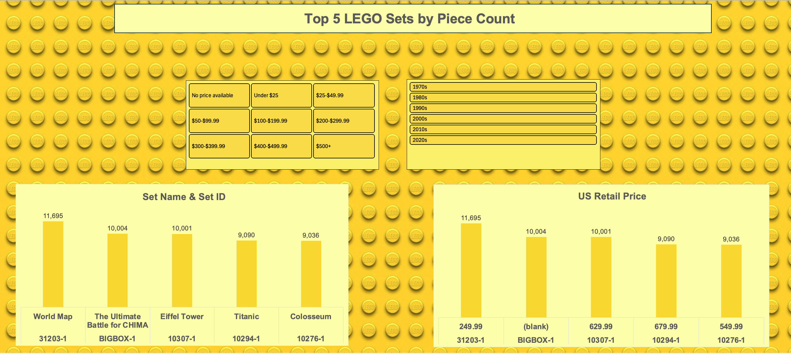
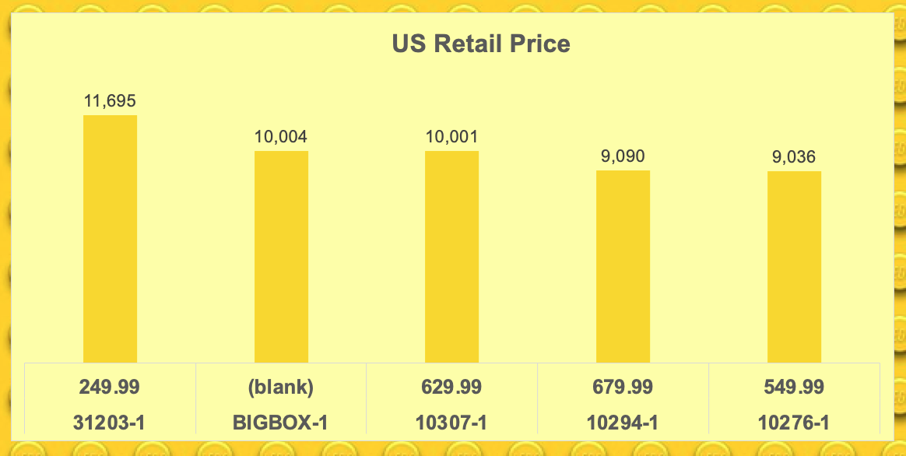
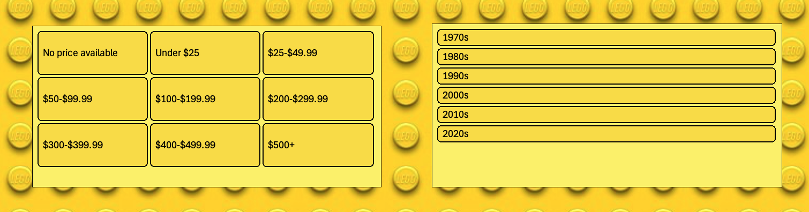

# Excel_LEGO_Sets

**The data used for this dashboard can be found at: https://mavenanalytics.io/data-playground/lego-sets
Also, I created a SQL project with this dataset as well! [Check it out](https://github.com/Nohemi-Flores/SQL_LEGO_Sets_Project)**

The Excel dashboard involves users by providing a price slicer and a decades slicer. The bar charts display the set name, set id, US retail price and piece count. There are some cases where more or less than 5 sets appear based on the options selected. Filtering the data to only include rows with every cell filled would reduce the ability to do the analysis shown through the dashboard.

## Dashboard Intro

**These skills made the dashboard possible:**

  **1. Charts:** bar charts
 
 **2. Formulas & Functions:** FLOOR(), 
                              
                              Table.AddColumn(#"Sorted rows", "price", 
                              each if[US_retailPrice] = null then "No price available"
                              else if[US_retailPrice] <25 then "Under $25"
                              else if[US_retailPrice] <50 then "$25-$49.99"
                              else if[US_retailPrice] <100 then "$50-$99.99"
                              else if[US_retailPrice] <200 then "$100-$199.99"
                              else if[US_retailPrice] <300 then "$200-$299.99"
                              else if[US_retailPrice]<400 then "$300-$399.99"
                              else if[US_retailPrice] <500 then "$400-$499.99"
                              else "$500+")
    
  **3. Power Query:** Exctract, Transform, Load

  **4. PivotTables**

  **5. PivotCharts**

---

**📊 Analysis**

**This analysis set out to answer 2 questions. The questions covered pieces counts and decades:**

**1. What are the top five LEGO sets each decade? And what are the US retail prices of these sets?**

---

## Dashboard

This dashboard was created to help LEGO collectors or anyone learn about sets from 1970 to 2022! 

[Check out the dashboard!](LS_Images/lego_sets.xlsx)

### Introduction
The data used in this dashboard includes information on LEGO sets, US retail prices, pieces counts, and release years.

### Excel Skills Used
- 📊 Charts
- <> Formulas and Functions
- 💪Power Query

### Data Jobs Dataset 
The dataset involves real-world data from 1970 to 2022. Dataset includes:
- 📇 Set Names
- 🆔 Set IDs
- 🧱 Pieces
- 🎉 Release Years

### Dashboard Build
📈 **PivotCharts**

📊 **LEGO Set Name and ID - Bar Chart**

- **Vertical bar chart was chosen. Data is presented according to the descending order of the piece count of the sets**
- **Set names and IDs are in the horizontal axis**

🌎 **US Retail Price - Bar Chart**

- **Vertical bar chart was chosen. Data is presented according to the descending order of the piece count of the sets**
- **Set IDs and year released are in the horizontal axis**

 **Also, *slicers* was added to help users navigate the dashboard.**

 
🧮 **Formulas and Functions**

- **Years were placed into their decades with the use of =FLOOR(), as stated above.**

     =FLOOR([@year],10) & "s"

- **US Retail Prices were placed in "buckets" using the formula demonstrated above. Sets with no price available in the US retail price column were labeled with "No Price Available" under that column. *Note*, Power Query was used to "bucket" prices.**

🔍 **Power Query (ETL)**

**The Price column was created using Power Query. After the column was created, the data was loaded back to a worksheet. Once in a worksheet, the decades column was created using the formula mentioned above.**

## Conclusion
 By exploring the data on LEGO sets released from 1970 to 2022, users can find out more about the top sets in each decade. But if patterns in themes or number of minifugres included in sets is what a user wants, they have to [check out my SQL project on that](https://github.com/Nohemi-Flores/SQL_LEGO_Sets_Project)!
